# Learning Neural Deformation Representation for 4D Dynamic Shape Generation

## Unconditional 4D Shape Generation

HyperDiffusion

Ours

## Conditional 4D Shape Generation
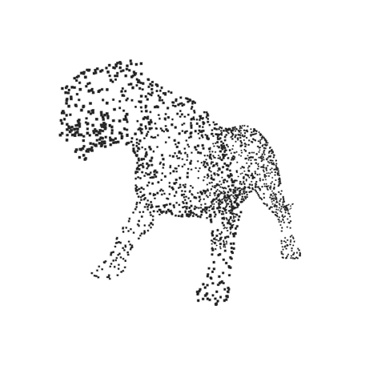
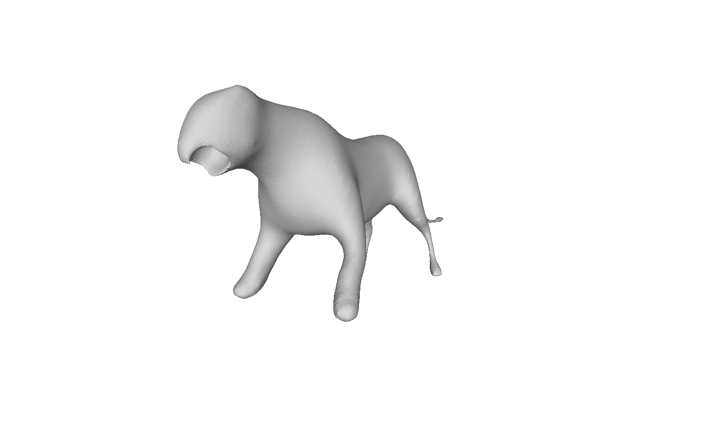

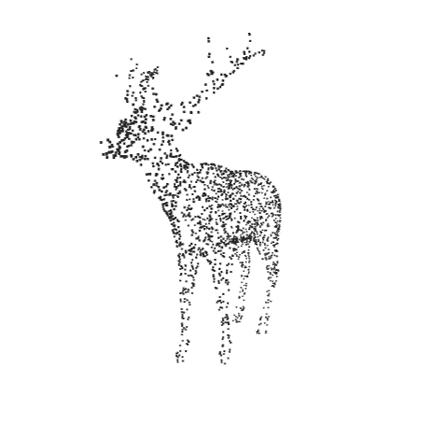
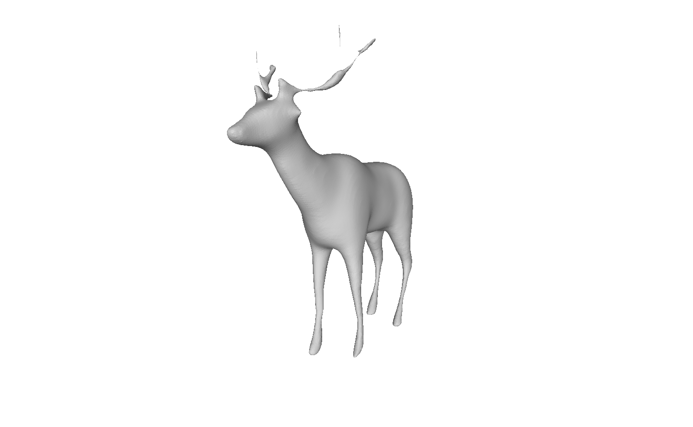

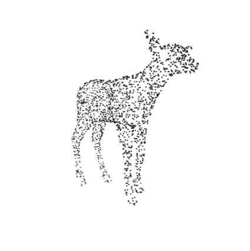
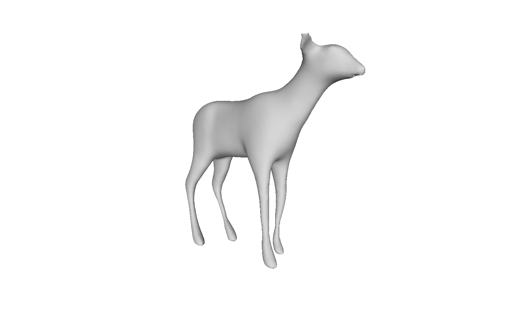

## Motion Retargeting

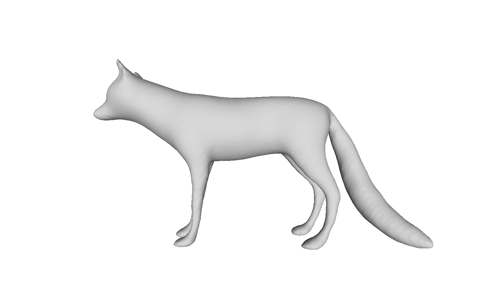
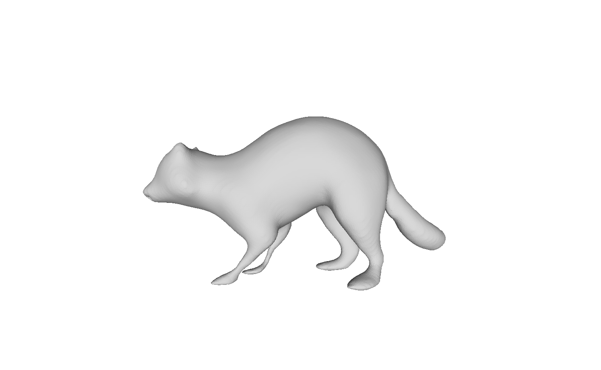
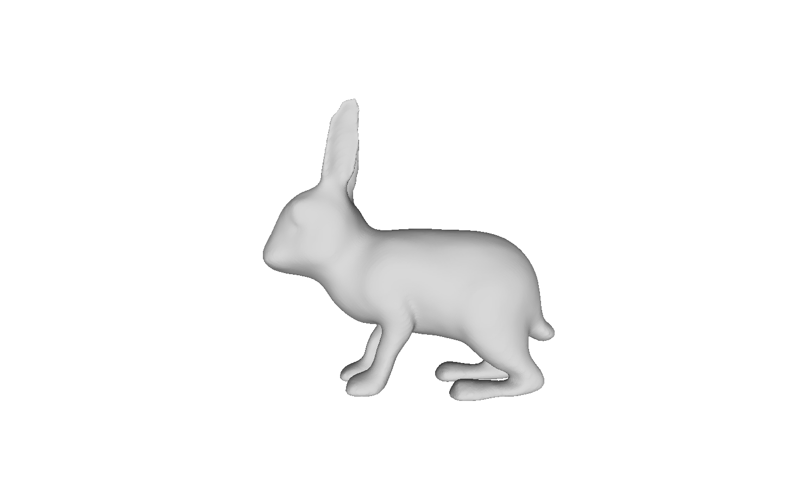

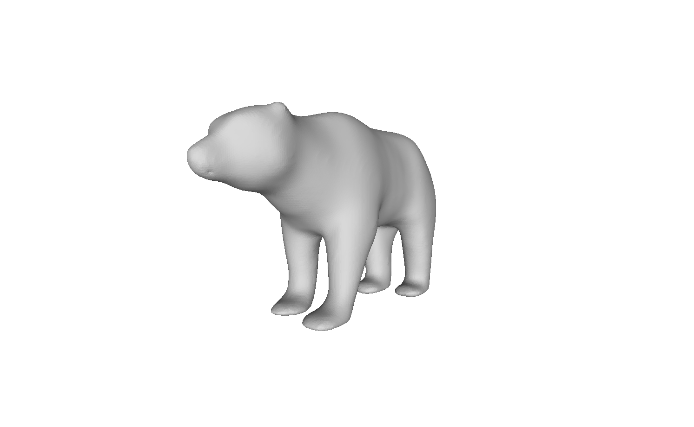
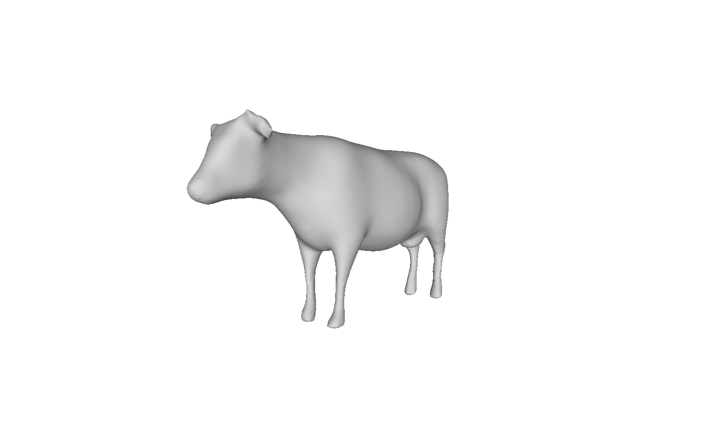
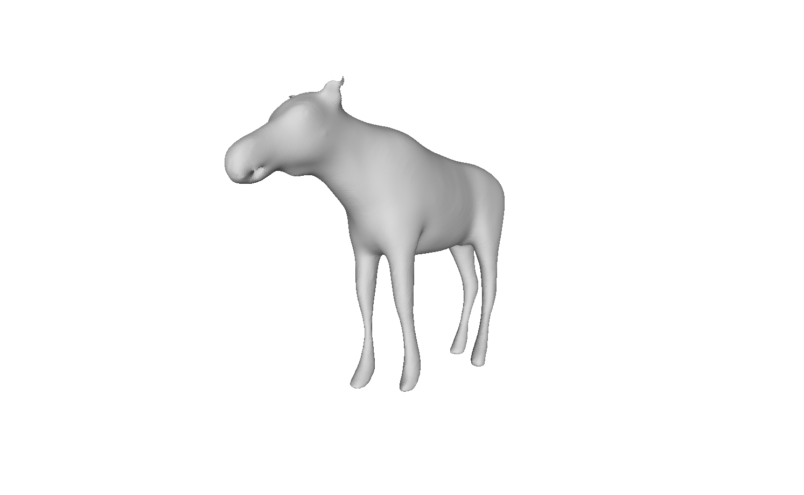

